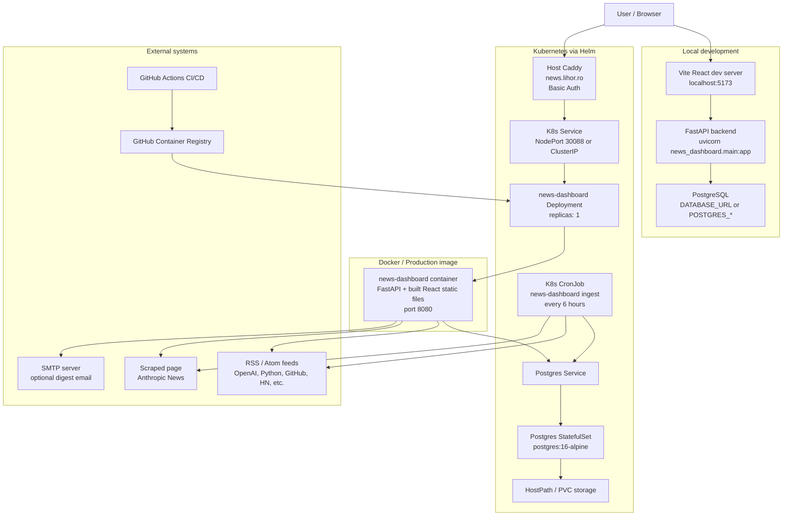
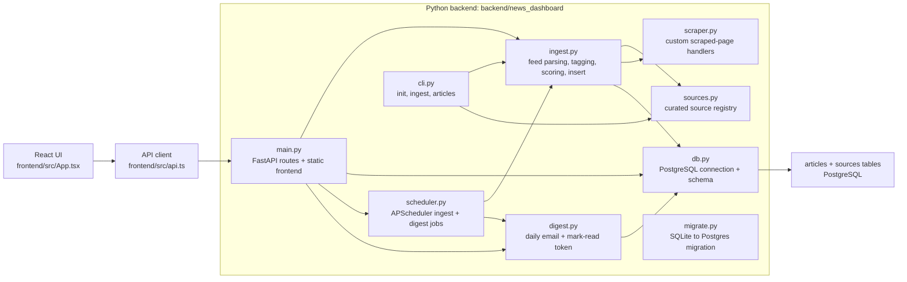
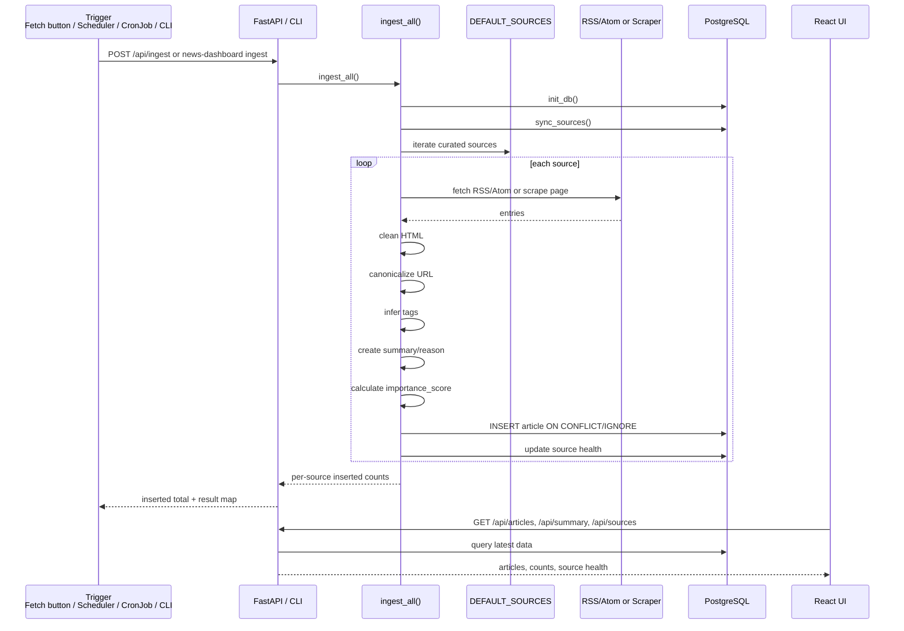
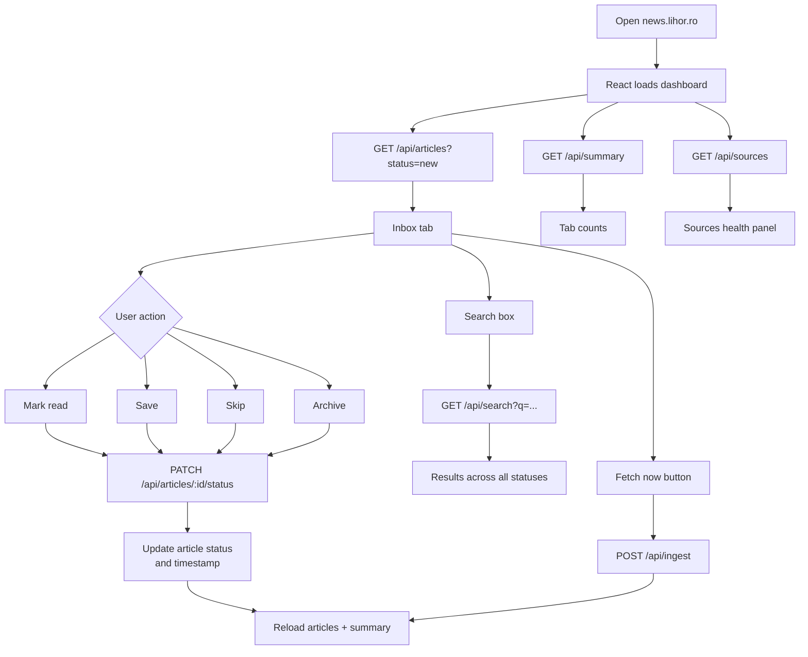
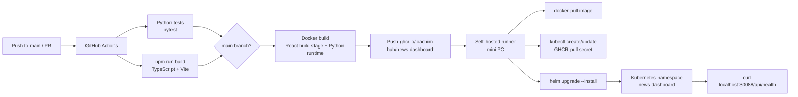

# News Dashboard Architecture

This project is a private personal news dashboard for `news.lihor.ro`. It collects curated technical news feeds, stores articles, lets the owner triage them as `new`, `read`, `saved`, `skipped`, or `archived`, tracks source health, and can send a daily digest email.

The system is not a large microservice platform. It is best understood as a modular monolith with a small number of runtime units:

- `news-dashboard`: the FastAPI backend, which also serves the built React frontend in container and Kubernetes deployments.
- `postgres`: the durable production database.
- `news-dashboard-ingest`: a Kubernetes CronJob batch workload that runs ingestion on a schedule.
- Optional external integrations: RSS/Atom feeds, a scraped Anthropic News page, SMTP, GHCR, GitHub Actions, and host-level Caddy.

## Database Contract

PostgreSQL is the application database. Runtime code should be written directly for PostgreSQL and psycopg:

- Use `%s` parameters, PostgreSQL functions/operators, and `ON CONFLICT` upserts.
- Do not add SQLite fallbacks, database-type sniffing, placeholder translation, or generic multi-database SQL.
- Configure the app with `DATABASE_URL` or `POSTGRES_HOST`, `POSTGRES_PORT`, `POSTGRES_DB`, `POSTGRES_USER`, and `POSTGRES_PASSWORD`.
- SQLite is allowed only as an input format for legacy migration tooling that imports old local data into PostgreSQL.

## Runtime Topology

## Application Modules

## Article Ingestion Flow

## User Flow

## CI/CD Flow

## Important Files

- `frontend/src/App.tsx`: the React dashboard, tabs, filters, article cards, source health panel, search, and manual fetch button.
- `frontend/src/api.ts`: browser-side API wrapper around `/api/...`.
- `backend/news_dashboard/main.py`: FastAPI app, API routes, startup/shutdown hooks, and static frontend serving.
- `backend/news_dashboard/ingest.py`: ingestion pipeline, URL canonicalization, source health updates, summaries, tags, and scoring.
- `backend/news_dashboard/sources.py`: curated source registry.
- `backend/news_dashboard/scraper.py`: custom scraped-page handlers, currently for Anthropic News.
- `backend/news_dashboard/db.py`: PostgreSQL configuration, psycopg connection handling, and schema setup.
- `backend/news_dashboard/scheduler.py`: in-process APScheduler jobs for ingest and digest.
- `backend/news_dashboard/digest.py`: daily digest email and signed mark-read links.
- `backend/news_dashboard/cli.py`: maintenance commands.
- `Dockerfile`: multi-stage build, React frontend first, Python runtime second.
- `docker-compose.yml`: local container topology with app plus Postgres.
- `helm/news-dashboard`: Kubernetes Deployment, Service, CronJob, Postgres StatefulSet, secrets, and storage.
- `.github/workflows/ci.yml`: tests, frontend build, image publish, and mini PC deployment.

## Database Model

The database has two main tables:

- `sources`: source registry and health information, including `last_checked_at`, `last_success_at`, `last_error`, `last_fetched_count`, and `last_inserted_count`.
- `articles`: normalized article records, including source metadata, category, kind, publication/discovery timestamps, status, importance score, summary, reason, tags, and status-specific timestamps.

PostgreSQL adds a generated `tsvector` column and GIN index. User-facing search uses PostgreSQL-native `ILIKE` filters today, leaving the generated full-text index available for a future ranking pass.

## How It Works

On startup, FastAPI syncs the configured sources into the database and starts the background scheduler. The scheduler periodically calls the same ingestion pipeline used by the manual `Fetch now` button and the CLI. In Kubernetes, a separate CronJob also runs `news-dashboard ingest` every six hours.

During ingestion, each source is fetched through either `feedparser` for RSS/Atom feeds or a custom scraper for sources that do not expose a feed. Entries are cleaned, URLs are canonicalized to remove tracking parameters, tags are inferred from keywords, summaries and reasons are generated from available text, and rows are inserted if the URL is new. The source row is then updated with success or error health information.

The React UI reads articles by status and category, displays summary counts, shows source health, and lets the user update article status. Status changes are persisted through `PATCH /api/articles/{article_id}/status`, and the UI reloads articles and counts afterward. Search calls `/api/search` and returns matching articles across statuses.

For production, GitHub Actions tests the Python backend, builds the frontend, builds a Docker image, pushes it to GHCR, and deploys it on a self-hosted runner with Helm. The host-level Caddy route exposes the Kubernetes NodePort at `news.lihor.ro` and applies Basic Auth outside the app.

## Operational Notes

- PostgreSQL is required in every runtime environment. SQLite is only a legacy migration input for importing old local data into PostgreSQL.
- The React app is served separately only in local development. In the production image, the built frontend is served by FastAPI.
- There are two scheduling mechanisms: in-process APScheduler and the Kubernetes CronJob. If duplicate ingestion is undesirable, configure one of them as the authoritative scheduler.
- Authentication is handled outside the app by host-level Caddy Basic Auth, according to the repository deployment notes.
