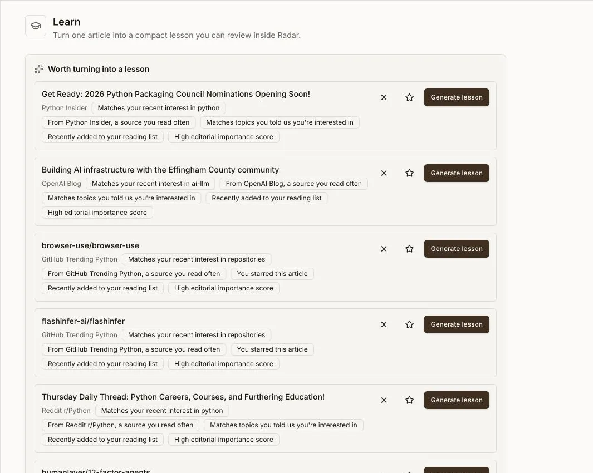

# Organize and learn

Use workflow states for articles already in News Dashboard, the Reading List
for links from anywhere, Collections for your own topics, and Learn when you
want to turn a source into a structured lesson.

## Set aside articles from Today

- **Later** holds articles you postponed and sorts them by return time. They
  return to Today automatically when their snooze period ends.
- **Starred** is the durable reference view. Star an article when you want to
  keep it easy to find and available to Ask's default saved corpus.

These are account workflow states, not separate copies of the article. See
[Saved and read history](saved-history.md) for the timestamps and history they
create.

## Build a Reading List from any link

**Reading List** accepts an HTTP or HTTPS link to an article, video, channel, or
other page. The app fetches preview details in the background when it can. You
can reorder items, search or filter by kind, and move them among Unread, Done,
and Archived without changing the Today workflow.

You can also import Pocket or Instapaper CSV exports and Omnivore JSON exports.
An unavailable preview does not remove the saved link.

## Group articles into Collections

**Collections** are your own named tags. Create a collection, then add or
remove its tag from the article reader. A collection is independent of the
article's workflow state, so an article can remain in a collection after you
mark it Done or Archive it.

## Turn reading into lessons

**Learn** creates a lesson from a URL. Choose a depth and audience persona,
generate the lesson, then work through its explanation and study activities.
The page can also suggest recent articles worth turning into lessons.

Lesson generation is an optional server-side AI capability. If generation is
unavailable, the deployment operator must configure the required provider.

- **Lesson Library** lists previous lessons. Search them and filter by
  generation status or read-worthiness verdict, then reopen a lesson.
- **Learning Recap** summarizes lessons touched and completed, key concepts,
  repeated themes, unfinished lessons, and notable material for the week. You
  can generate the recap now. Podcast creation additionally needs a configured
  server-side audio path.
- **Weekly Recap** is separate: it summarizes reading activity such as
  articles, time, streak, top categories and sources, saved backlog, and
  reading depth.

## Save article bodies for offline reading

From an article reader, use **Save for offline**. **Offline Saved** lists those
explicitly saved articles and lets you open or remove the device-local copy.
The app stores the article body in the browser cache and keeps a local index
with its title, source, original URL, and save time. The app shell and those
cached bodies remain available without a network after the production PWA has
been loaded.

The **Save offline** action in Later can cache the bodies currently shown in
that queue. Caching is best-effort: an article whose body cannot be fetched is
skipped while the rest continue.

Offline storage is local to that browser profile and is bounded by the app's
cache policy. Do not treat it as account-wide synchronization, a server backup,
or a promise that uncached pages, original websites, triage actions, Ask, or
lesson generation will work without a connection.
